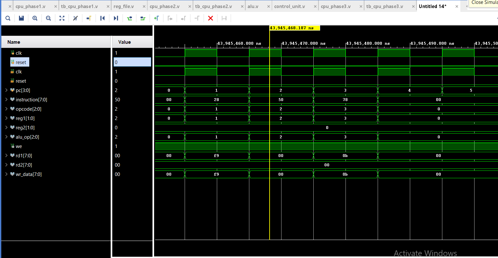

#  Mini CPU Design using Verilog (Phase 3)

##  Overview
This project implements a simple 8-bit Mini CPU using Verilog HDL.  
The CPU is designed using a modular architecture including a Program Counter, Instruction Memory, Register File, ALU, and Control Unit.

##  Features
- 8-bit data width
- 4-register architecture
- Moore-style control logic
- Supports basic instructions:
  - ADD
  - SUB
  - AND
  - OR
- Synchronous design using clock and reset
- Fully simulated in Xilinx Vivado

##  Architecture
PC → Instruction Memory → Control Unit → ALU → Register File

##  Instruction Format

| Bits     | Field    |
|----------|---------|
| [7:5]    | Opcode  |
| [4:3]    | Reg1    |
| [2:1]    | Reg2    |

---

##  Modules

###  Program Counter (PC)
- Generates instruction address
- Increments every clock cycle

###  Instruction Memory
- Stores predefined instructions
- Outputs instruction based on PC

###  Control Unit
- Decodes opcode
- Generates ALU control signals

###  Register File
- 4 registers (8-bit each)
- Dual read, single write

###  ALU
- Performs arithmetic & logic operations

##  Simulation

- Tool: Xilinx Vivado
- Verified:
  - Instruction execution
  - Register updates
  - ALU operations

##  Waveform

##  Learning Outcomes
- CPU architecture basics
- Instruction decoding
- Data path & control path design
- Verilog modular design
- Debugging hardware simulation

---

## Future Improvements
- Immediate instructions (ADDI)
- Branching & Jump instructions
- Pipeline architecture
- UART integration

##  Author
Mohd Ehsan Muzammil
